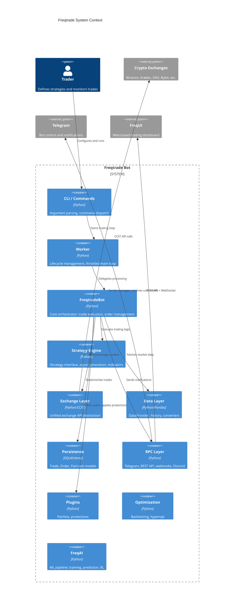
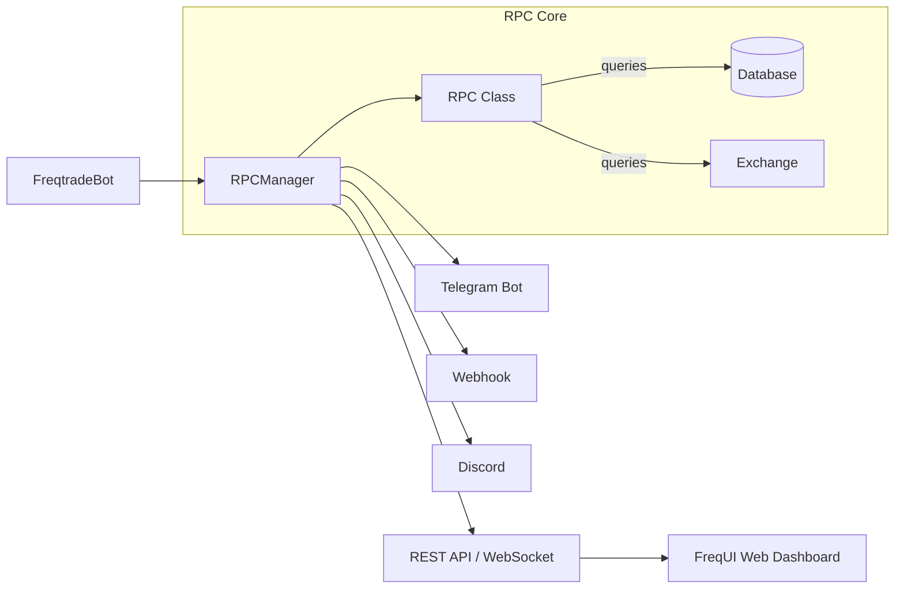
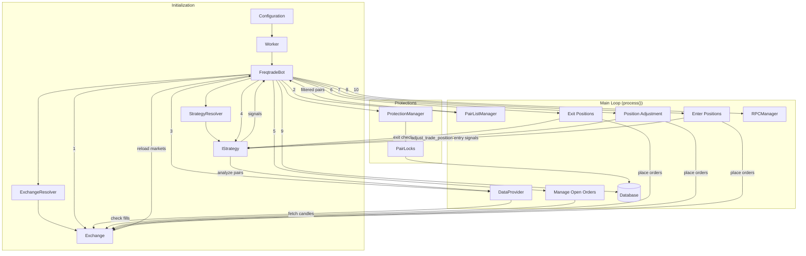
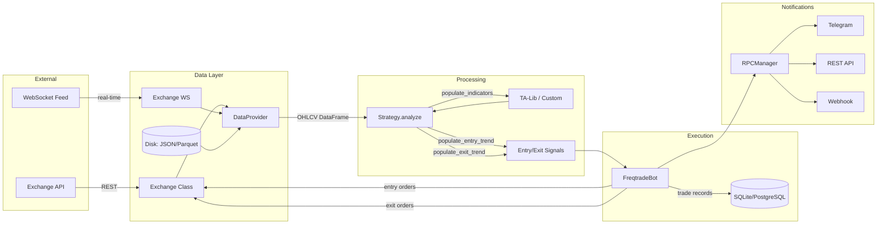
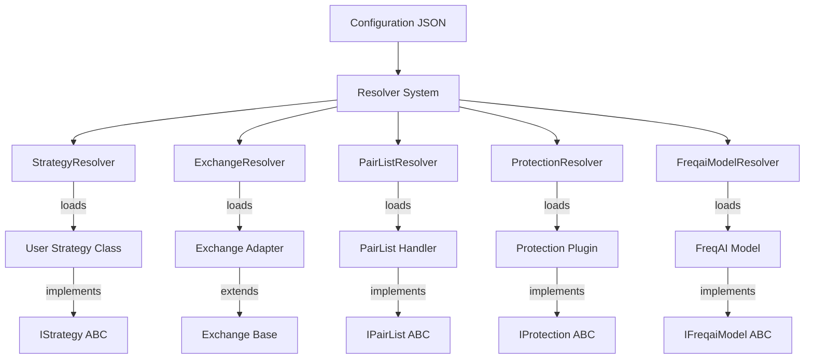
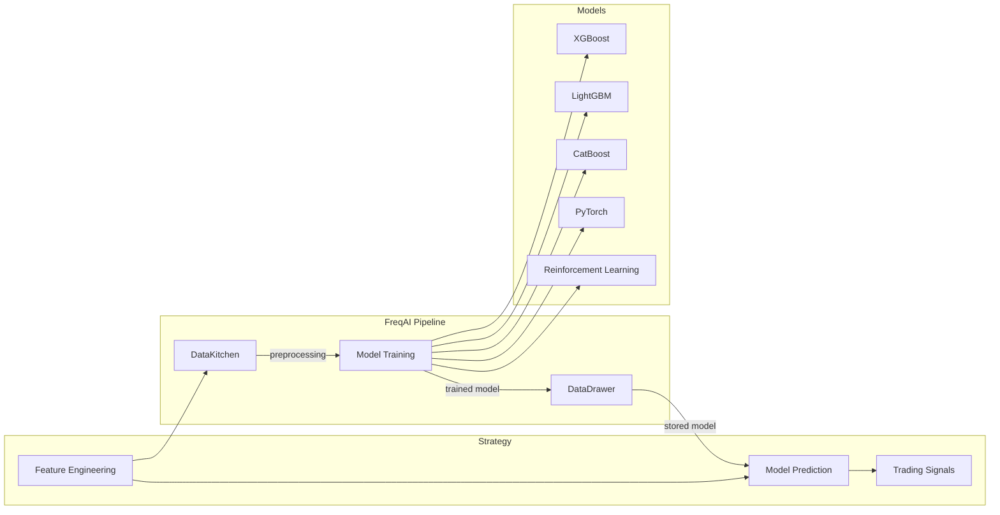

# Freqtrade Architecture

## High-Level System Architecture

Freqtrade is structured as a layered, event-driven system. The CLI parses commands and dispatches to the appropriate subsystem (trading, backtesting, hyperopt, data management). For live/dry-run trading, the `Worker` manages the bot lifecycle and delegates to `FreqtradeBot`, which orchestrates all trading operations.

## Trading Paradigm & Key Features

| Feature | Support | Details |
|---------|---------|---------|
| Backtesting Approach | Event-driven | Candle-by-candle simulation via `Backtesting` class with `LocalTrade` (in-memory) |
| Live Trading | Yes | Full live trading via CCXT on 25+ crypto exchanges |
| Paper Trading | Yes | Dry-run mode with simulated wallets and order execution |
| Multi-Asset | Yes | All crypto pairs supported by connected exchanges (spot, margin, futures) |
| Data Feeds | Exchange REST + WebSocket | OHLCV candles, tickers, order books via CCXT; historical data in JSON/Parquet |
| ML Integration | Yes | FreqAI module: XGBoost, LightGBM, CatBoost, PyTorch, reinforcement learning |
| Risk Management | Built-in | Fixed/trailing/custom stoploss, ROI tables, protections (cooldown, drawdown guard, stoploss guard) |
| Optimization | Yes | Hyperparameter optimization via Optuna (Sharpe, Sortino, Calmar, drawdown loss functions) |
| Execution | Both | Simulated in backtesting; live limit/market/stoploss orders on exchanges |

## Core Components

### FreqtradeBot (`src/freqtrade/freqtradebot.py`)

The central orchestrator class (~3000 lines). It manages the complete trade lifecycle within a single `process()` call:

1. Reload exchange markets if needed
2. Update fees for trades without assigned fees
3. Query open trades from the database
4. Refresh the active pair whitelist (via PairListManager)
5. Refresh candle data for all active pairs
6. Call `strategy.bot_loop_start()` for per-iteration strategy logic
7. Run strategy analysis (indicators + signals) on all pairs
8. Manage open orders (check for fills, timeouts, cancellations)
9. Check exit conditions on open positions (stoploss, ROI, signals, custom exit)
10. Process position adjustments (DCA) if enabled
11. Enter new positions based on entry signals
12. Run scheduled tasks (funding fees, liquidation prices)
13. Commit database changes and process RPC message queue

**Key responsibilities**:
- `execute_entry()` -- Places entry orders (initial or DCA)
- `execute_trade_exit()` -- Places exit orders
- `handle_trade()` -- Evaluates exit conditions for a single trade
- `handle_stoploss_on_exchange()` -- Manages exchange-side stoploss orders
- `manage_open_orders()` -- Handles order timeouts, partial fills, replacements
- `process_open_trade_positions()` -- DCA position adjustment logic
- `update_trade_state()` -- Synchronizes order state with exchange

### Strategy Interface (`src/freqtrade/strategy/interface.py`)

The `IStrategy` abstract base class defines the contract that all user strategies must implement. It inherits from `HyperStrategyMixin` for hyperparameter support.

**Required methods**:
- `populate_indicators(dataframe, metadata)` -- Add technical indicators to the OHLCV dataframe
- `populate_entry_trend(dataframe, metadata)` -- Set `enter_long` / `enter_short` columns
- `populate_exit_trend(dataframe, metadata)` -- Set `exit_long` / `exit_short` columns

**Optional override methods**:
- `custom_stoploss()` -- Dynamic stoploss calculation per trade
- `custom_exit()` -- Custom exit logic beyond signals and ROI
- `custom_entry_price()` / `custom_exit_price()` -- Custom order pricing
- `custom_stake_amount()` -- Dynamic position sizing
- `adjust_trade_position()` -- DCA / position adjustment logic
- `confirm_trade_entry()` / `confirm_trade_exit()` -- Final confirmation before order placement
- `leverage()` -- Per-pair leverage calculation
- `bot_start()` -- One-time initialization after bot start
- `bot_loop_start()` -- Called each iteration of the main loop
- `check_entry_timeout()` / `check_exit_timeout()` -- Custom order timeout handling

**Key attributes**:
- `timeframe` -- Candle timeframe (e.g., `"5m"`, `"1h"`)
- `minimal_roi` -- ROI table for time-based profit taking
- `stoploss` -- Default stoploss percentage
- `trailing_stop` / `trailing_stop_positive` -- Trailing stoploss configuration
- `can_short` -- Whether the strategy supports short positions
- `position_adjustment_enable` -- Enable DCA via `adjust_trade_position()`
- `order_types` -- Order type configuration (limit/market for entry/exit/stoploss)
- `process_only_new_candles` -- Skip analysis if no new candle since last iteration

**FreqAI integration methods**:
- `feature_engineering_expand_all()` -- Feature engineering applied to all timeframes
- `feature_engineering_expand_basic()` -- Basic feature engineering
- `feature_engineering_standard()` -- Standard features on the base timeframe

### Exchange Abstraction (`src/freqtrade/exchange/`)

The exchange layer provides a unified interface to 25+ cryptocurrency exchanges through CCXT. The base `Exchange` class (`exchange.py`) handles:

- Order placement (market, limit, stoploss)
- Market data retrieval (OHLCV candles, tickers, orderbook)
- Balance and position queries
- Rate limiting and retry logic with exponential backoff
- WebSocket connections for real-time data (`exchange_ws.py`)
- Precision handling for amounts and prices
- Contract size normalization for futures

**Exchange-specific adapters** extend the base class to handle exchange quirks:

| File | Exchange |
|------|----------|
| `binance.py` | Binance (Spot + Futures) |
| `kraken.py` / `krakenfutures.py` | Kraken |
| `okx.py` | OKX |
| `bybit.py` | Bybit |
| `gate.py` | Gate.io |
| `kucoin.py` | Kucoin |
| `bitget.py` | Bitget |
| `htx.py` | HTX (Huobi) |
| `hyperliquid.py` | Hyperliquid |
| `coinex.py` | CoinEx |
| `bitvavo.py` | Bitvavo |
| `cryptocom.py` | Crypto.com |
| `lbank.py` | LBank |

The `ExchangeResolver` dynamically loads the correct exchange class based on configuration.

### DataProvider (`src/freqtrade/data/dataprovider.py`)

The `DataProvider` is the unified data access layer available to both the bot and strategies (via `self.dp`). It provides:

- **Candle data**: OHLCV data for any pair/timeframe combination
- **Orderbook**: Current order book snapshots
- **Ticker**: Latest price/volume data
- **Historical data**: Access to data stored on disk (JSON/Parquet via `DataHandler`)
- **Producer data**: Candle data from external Freqtrade instances (ExternalMessageConsumer)
- **Caching**: In-memory cache with TTL-based expiration per timeframe

Data flow during live trading:
1. `DataProvider.refresh()` fetches new candles from the exchange
2. Strategy accesses data via `self.dp.get_analyzed_dataframe(pair, timeframe)`
3. Results are cached and sliced to prevent look-ahead bias in backtesting

### RPC Layer (`src/freqtrade/rpc/`)

The RPC system enables remote monitoring and control through multiple channels:

- **`RPCManager`** (`rpc_manager.py`) -- Routes messages to all enabled RPC handlers
- **`RPC`** (`rpc.py`) -- Core business logic for all RPC operations (trade status, profit calculations, force actions)
- **`Telegram`** (`telegram.py`) -- Full bot control via Telegram commands (`/start`, `/stop`, `/status`, `/profit`, `/forcesell`, etc.)
- **`ApiServer`** (`api_server/`) -- FastAPI-based REST API with JWT authentication, WebSocket support for real-time updates, and static file serving for FreqUI
- **`Webhook`** (`webhook.py`) -- HTTP POST notifications on trade events
- **`Discord`** (`discord.py`) -- Discord webhook notifications

**Message types** (`RPCMessageType` enum):
- `ENTRY` / `ENTRY_FILL` / `ENTRY_CANCEL` -- Entry order lifecycle
- `EXIT` / `EXIT_FILL` / `EXIT_CANCEL` -- Exit order lifecycle
- `PROTECTION_TRIGGER` / `PROTECTION_TRIGGER_GLOBAL` -- Protection activations
- `STATUS` / `WARNING` / `EXCEPTION` -- Bot status messages
- `STRATEGY_MSG` -- Custom messages from strategy code
- `WHITELIST` / `ANALYZED_DF` / `NEW_CANDLE` -- Data update events

### Persistence (`src/freqtrade/persistence/`)

SQLAlchemy-based database layer for trade state persistence. Default database is SQLite; PostgreSQL is also supported.

**Models**:
- **`Trade`** (`trade_model.py`) -- Complete trade record including entry/exit prices, profit, fees, stoploss levels, leverage, funding fees, and metadata. Inherits from `LocalTrade` (used in backtesting without DB).
- **`Order`** (`trade_model.py`) -- Individual order records linked to trades (one-to-many). Mirrors CCXT order structure with additional Freqtrade metadata.
- **`PairLock`** (`pairlock.py`) -- Time-based locks preventing trading on specific pairs (used by protections and manual locks).
- **`CustomData`** (`custom_data.py`) -- Key-value storage for strategy-specific data per trade.
- **`KeyValueStore`** (`key_value_store.py`) -- Global key-value storage for bot-level metadata.

**Middleware**:
- **`PairLocks`** (`pairlock_middleware.py`) -- Abstraction layer that works with both database and in-memory storage (for backtesting).

### Plugins (`src/freqtrade/plugins/`)

#### PairList Handlers (`src/freqtrade/plugins/pairlist/`)

The `PairListManager` chains multiple pairlist handlers to build and filter the active trading pair whitelist. Each handler implements `IPairList`:

| Handler | Purpose |
|---------|---------|
| `StaticPairList` | Fixed list from configuration |
| `VolumePairList` | Top pairs by trading volume |
| `MarketCapPairList` | Top pairs by market capitalization |
| `PercentChangePairList` | Filter by price change percentage |
| `PerformanceFilter` | Filter based on past trading performance |
| `PrecisionFilter` | Remove pairs with too few price decimals |
| `PriceFilter` | Filter by min/max price |
| `SpreadFilter` | Filter by bid/ask spread |
| `VolatilityFilter` | Filter by price volatility |
| `RangeStabilityFilter` | Filter by price range stability |
| `AgeFilter` | Filter newly listed pairs |
| `DelistFilter` | Remove delisted/delisting pairs |
| `OffsetFilter` | Skip first N pairs (pagination) |
| `ShuffleFilter` | Randomize pair order |
| `FullTradesFilter` | Remove pairs that already have open trades |
| `CrossMarketPairList` | Cross-market pair matching |
| `ProducerPairList` | Pairs from external Freqtrade instance |
| `RemotePairList` | Pairs from remote HTTP endpoint |

Handlers are chained in configuration order: the first handler generates the initial list, subsequent handlers filter it.

#### Protection Plugins (`src/freqtrade/plugins/protections/`)

The `ProtectionManager` applies trading protections that can lock pairs or halt trading globally:

| Protection | Purpose |
|------------|---------|
| `CooldownPeriod` | Lock a pair for N candles after a trade |
| `StoplossGuard` | Lock pair/global after N stoploss events in a time window |
| `MaxDrawdownProtection` | Lock trading after max drawdown is reached |
| `LowProfitPairs` | Lock pairs with poor profit performance |

Each protection implements `IProtection` with `global_stop()` and `stop_per_pair()` methods. When triggered, they create `PairLock` entries.

## Component Interaction

## Data Flow

## Plugin Architecture

Freqtrade uses a resolver-based plugin system for dynamic loading of components. The `resolvers/` module contains resolvers for:

- **`StrategyResolver`** -- Loads strategy classes from user directories or built-in templates
- **`ExchangeResolver`** -- Loads exchange-specific adapter classes
- **`PairListResolver`** -- Loads pairlist handler plugins
- **`ProtectionResolver`** -- Loads protection plugins
- **`FreqaiModelResolver`** -- Loads FreqAI model implementations

Each resolver searches configured directories for Python files, imports them, and verifies they implement the required interface. This allows users to create custom plugins (strategies, pairlist handlers, protections, ML models) by simply placing Python files in the appropriate directory.

## Optimization Architecture

### Backtesting (`src/freqtrade/optimize/backtesting.py`)

The `Backtesting` class simulates trading on historical data:

1. Loads historical OHLCV data for all pairs in the whitelist
2. Runs strategy analysis (indicators + signals) on the full dataset
3. Iterates through candles chronologically, simulating the trading loop
4. Tracks trades using `LocalTrade` (in-memory, no database)
5. Generates detailed statistics, trade lists, and performance reports

Backtesting supports multi-strategy runs, dynamic pairlists, detailed trade analysis, and signal/rejected-signal export for debugging.

### Hyperopt (`src/freqtrade/optimize/hyperopt/`)

The `Hyperopt` class wraps backtesting with Optuna for parameter optimization:

1. Defines search spaces from strategy parameters (`IntParameter`, `DecimalParameter`, `CategoricalParameter`, `BooleanParameter`)
2. Runs backtesting trials with different parameter combinations
3. Evaluates results using configurable loss functions
4. Supports parallel execution via joblib
5. Stores results in `.fthypt` files for later analysis

Available loss functions include: `SharpeHyperOptLoss`, `SortinoHyperOptLoss`, `CalmarHyperOptLoss`, `MaxDrawDownHyperOptLoss`, `ProfitDrawDownHyperOptLoss`, `MultiMetricHyperOptLoss`, and more.

## FreqAI Architecture

FreqAI integrates machine learning into the strategy pipeline:

- **`FreqaiInterface`** (`freqai_interface.py`) -- Base class for all FreqAI models
- **`DataKitchen`** (`data_kitchen.py`) -- Data preprocessing, feature engineering, train/test splitting
- **`DataDrawer`** (`data_drawer.py`) -- Model storage, loading, and metadata management
- **Prediction Models** (`prediction_models/`) -- Pre-built model implementations
- **RL** (`RL/`) -- Reinforcement learning environments and agents

---
## See Also
- [README](README.md) — Project overview and quick start
- [Workflow](workflow.md) — Event flows and processing pipelines
- [State Management](state-management.md) — State lifecycle and data models
- [Development](development.md) — Development guide and best practices
