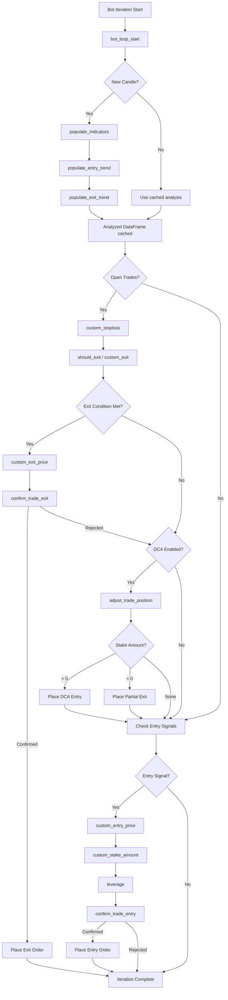

# Freqtrade Development Guide

## Development Setup

### Prerequisites

- Python >= 3.13
- TA-Lib system library (required for technical indicators)
- Git

### Installation

```bash
# Clone the repository
git clone https://github.com/freqtrade/freqtrade.git
cd freqtrade

# Automated setup (recommended)
./setup.sh

# Manual setup with pip
pip install -e .

# Development setup with all dependencies
pip install -e .[dev]

# Install specific feature sets
pip install -e .[plot]          # Plotting capabilities
pip install -e .[hyperopt]      # Hyperparameter optimization
pip install -e .[freqai]        # Machine learning features
pip install -e .[freqai_rl]     # Reinforcement learning
```

### Pre-commit Hooks

```bash
# Install pre-commit hooks (recommended for development)
pre-commit install

# Run all hooks manually
pre-commit run -a
```

### Code Quality Tools

```bash
# Linting and formatting (ruff)
ruff check .
ruff format .

# Type checking
mypy freqtrade

# Run tests
pytest
pytest -n auto          # Parallel execution
pytest --cov=freqtrade  # With coverage
```

## Project Structure

```
freqtrade/
  src/freqtrade/                    # Main package
    __init__.py                     # Version (2026.4-dev)
    __main__.py                     # Entry point for `python -m freqtrade`
    main.py                         # CLI entry: argument parsing, command dispatch
    worker.py                       # Bot lifecycle manager, throttled main loop
    freqtradebot.py                 # Core orchestrator (~3000 lines)
    wallets.py                      # Balance and position tracking
    constants.py                    # Global constants, type aliases
    exceptions.py                   # Custom exception hierarchy
    misc.py                         # Utility functions

    commands/                       # CLI command implementations
      arguments.py                  # Argument parser setup
      cli_options.py                # CLI option definitions
      trade_commands.py             # `freqtrade trade` command
      optimize_commands.py          # Backtesting and hyperopt commands
      data_commands.py              # Data download commands
      deploy_commands.py            # Strategy and config deployment
      deploy_ui.py                  # FreqUI installation
      list_commands.py              # List strategies, exchanges, etc.
      plot_commands.py              # Plotting commands
      analyze_commands.py           # Backtest analysis commands
      pairlist_commands.py          # Pairlist testing commands
      db_commands.py                # Database management
      webserver_commands.py         # Webserver start command
      hyperopt_commands.py          # Hyperopt result commands
      strategy_utils_commands.py    # Strategy utility commands

    configuration/                  # Config loading and validation
      config_schema/                # JSON Schema for config validation

    strategy/                       # Strategy framework
      interface.py                  # IStrategy abstract base class
      parameters.py                 # Hyperoptable parameter classes
      hyper.py                      # HyperStrategyMixin for parameter loading
      informative_decorator.py      # @informative decorator for multi-timeframe
      strategy_wrapper.py           # Safe wrapper for strategy method calls
      strategy_helper.py            # Helper functions (merge informative, stoploss calc)
      strategy_validation.py        # DataFrame validation after strategy analysis
      strategyupdater.py            # Strategy migration tool

    exchange/                       # Exchange abstraction layer
      exchange.py                   # Base Exchange class (~2500 lines)
      exchange_ws.py                # WebSocket support
      exchange_types.py             # Type definitions (CcxtOrder, Ticker, etc.)
      exchange_utils.py             # Price/amount precision utilities
      common.py                     # Retry decorators, rate limiting
      binance.py                    # Binance-specific adapter
      kraken.py                     # Kraken adapter
      okx.py                        # OKX adapter
      bybit.py                      # Bybit adapter
      gate.py                       # Gate.io adapter
      kucoin.py                     # Kucoin adapter
      bitget.py                     # Bitget adapter
      ... (20+ exchange adapters)

    data/                           # Data management
      dataprovider.py               # Unified data access for bot and strategies
      history/                      # Historical data loading and storage
      converter/                    # Data format conversion (OHLCV, trades)
      btanalysis/                   # Backtesting result analysis
      metrics.py                    # Performance metrics (Sharpe, Sortino, etc.)

    persistence/                    # Database layer
      base.py                       # SQLAlchemy base model
      trade_model.py                # Trade and Order models
      pairlock.py                   # PairLock model
      pairlock_middleware.py        # PairLocks abstraction (DB + in-memory)
      custom_data.py                # Key-value storage per trade
      key_value_store.py            # Global key-value storage
      models.py                     # Model registry and convenience imports
      migrations.py                 # Database migration logic

    plugins/                        # Plugin system
      pairlist/                     # Pairlist handlers
        IPairList.py                # Abstract base class
        StaticPairList.py           # Fixed pair list
        VolumePairList.py           # Volume-based pair selection
        ... (20+ handlers)
      pairlistmanager.py            # Pairlist handler chain manager
      protections/                  # Protection plugins
        iprotection.py              # Abstract base class
        cooldown_period.py          # Post-trade cooldown
        stoploss_guard.py           # Stoploss event protection
        max_drawdown_protection.py  # Max drawdown circuit breaker
        low_profit_pairs.py         # Low-profit pair locking
      protectionmanager.py          # Protection handler manager

    rpc/                            # Remote control interfaces
      rpc.py                        # Core RPC business logic
      rpc_manager.py                # Handler registration and message dispatch
      rpc_types.py                  # Message type definitions
      telegram.py                   # Telegram bot integration
      webhook.py                    # Webhook notifications
      discord.py                    # Discord integration
      api_server/                   # FastAPI REST API + WebSocket
        webserver.py                # Server setup and configuration
        api_v1.py                   # API route definitions
        api_auth.py                 # JWT authentication
        api_ws.py                   # WebSocket endpoint
        api_schemas.py              # Pydantic request/response models
        api_trading.py              # Trading endpoints (force buy/sell)
        api_backtest.py             # Backtesting endpoints
        api_pair_history.py         # Pair data endpoints
        deps.py                     # FastAPI dependencies
      external_message_consumer.py  # Consume data from other Freqtrade instances

    optimize/                       # Optimization framework
      backtesting.py                # Backtesting engine
      backtest_caching.py           # Backtest result caching
      bt_progress.py                # Progress tracking
      optimize_reports/             # Report generation (text, JSON)
      hyperopt/                     # Hyperparameter optimization
        hyperopt.py                 # Main hyperopt class
        hyperopt_optimizer.py       # Optuna integration
        hyperopt_interface.py       # Hyperopt interface
        hyperopt_auto.py            # Auto-hyperopt logic
        hyperopt_output.py          # Result formatting
      hyperopt_loss/                # Loss function implementations
      hyperopt_tools.py             # Shared hyperopt utilities
      space/                        # Search space definitions
      analysis/                     # Trade analysis tools

    freqai/                         # Machine learning integration
      freqai_interface.py           # Base FreqAI model interface
      data_kitchen.py               # Data preprocessing pipeline
      data_drawer.py                # Model persistence and metadata
      base_models/                  # Base model implementations
      prediction_models/            # Pre-built ML models
      RL/                           # Reinforcement learning
      torch/                        # PyTorch-specific utilities
      tensorboard/                  # TensorBoard integration
      utils.py                      # FreqAI utility functions

    resolvers/                      # Dynamic component loading
    enums/                          # Type-safe enumerations
    ft_types/                       # Type definitions
    leverage/                       # Leverage and liquidation calculations
    loggers/                        # Logging configuration
    mixins/                         # Shared mixin classes (LoggingMixin)
    plot/                           # Plotting utilities
    templates/                      # Strategy and config templates
    util/                           # Utility functions and helpers
    vendor/                         # Vendored dependencies
    system/                         # System-level setup (asyncio, GC, multiprocessing)

  tests/                            # Test suite (mirrors src/ structure)
    conftest.py                     # Shared fixtures
    conftest_trades.py              # Trade-related fixtures
    freqtradebot/                   # FreqtradeBot tests
    strategy/                       # Strategy tests
    exchange/                       # Exchange tests
    optimize/                       # Backtesting/hyperopt tests
    persistence/                    # Database tests
    rpc/                            # RPC tests
    plugins/                        # Plugin tests
    data/                           # Data handler tests
    freqai/                         # FreqAI tests
```

## Code Standards and Conventions

### Style Rules

- **Line length**: 100 characters (enforced by ruff)
- **Import ordering**: Managed by isort (2 blank lines after imports)
- **Type hints**: Required for all public methods (enforced by mypy)
- **Docstrings**: Required for public methods, use reST format (`:param:`, `:return:`, `:raises:`)

### Naming Conventions

- Classes: `PascalCase` (e.g., `FreqtradeBot`, `IStrategy`)
- Functions/methods: `snake_case` (e.g., `execute_entry`, `get_trade_stake_amount`)
- Constants: `UPPER_SNAKE_CASE` (e.g., `PROCESS_THROTTLE_SECS`, `DEFAULT_DB_PROD_URL`)
- Private methods: `_leading_underscore` (e.g., `_refresh_active_whitelist`)
- Internal/protected: `__double_underscore` for name-mangled attributes

### Common Patterns

- **Strategy-safe wrapper**: All strategy callback invocations are wrapped in `strategy_safe_wrapper()` to catch and log exceptions without crashing the bot.
- **Exit lock**: The `_exit_lock` (threading.Lock) protects exit logic from concurrent access by the main loop and RPC commands (e.g., force sell from Telegram).
- **Periodic cache**: `PeriodicCache` provides TTL-based caching with candle-aligned expiration.
- **LoggingMixin**: Provides `log_once()` to avoid spamming repeated messages.

### Error Handling Hierarchy

```
FreqtradeException
  OperationalException        # Unrecoverable config/setup errors
  ConfigurationError          # Configuration validation failures
  DependencyException         # Runtime dependency issues
    InsufficientFundsError    # Not enough balance
    InvalidOrderException     # Order placement failures
  ExchangeError               # Exchange communication failures
    DDosProtection            # Rate limiting / DDoS protection
    RetryableOrderError       # Transient order errors
    TemporaryError            # Temporary exchange issues
  PricingError                # Price calculation failures
  StrategyError               # Strategy logic errors
```

## Strategy Development Guide

### Minimal Strategy

```python
from pandas import DataFrame
from freqtrade.strategy import IStrategy, IntParameter
import talib.abstract as ta


class MyStrategy(IStrategy):
    INTERFACE_VERSION = 3

    # Required attributes
    timeframe = "5m"
    minimal_roi = {"60": 0.01, "30": 0.02, "0": 0.04}
    stoploss = -0.10

    # Optional
    can_short = False
    trailing_stop = False
    startup_candle_count = 200
    process_only_new_candles = True
    use_exit_signal = True

    # Hyperoptable parameters
    buy_rsi = IntParameter(low=10, high=40, default=30, space="buy")
    sell_rsi = IntParameter(low=60, high=90, default=70, space="sell")

    def populate_indicators(self, dataframe: DataFrame, metadata: dict) -> DataFrame:
        dataframe["rsi"] = ta.RSI(dataframe, timeperiod=14)
        dataframe["ema_50"] = ta.EMA(dataframe, timeperiod=50)
        dataframe["ema_200"] = ta.EMA(dataframe, timeperiod=200)
        return dataframe

    def populate_entry_trend(self, dataframe: DataFrame, metadata: dict) -> DataFrame:
        dataframe.loc[
            (dataframe["rsi"] < self.buy_rsi.value) &
            (dataframe["ema_50"] > dataframe["ema_200"]) &
            (dataframe["volume"] > 0),
            "enter_long"
        ] = 1
        return dataframe

    def populate_exit_trend(self, dataframe: DataFrame, metadata: dict) -> DataFrame:
        dataframe.loc[
            (dataframe["rsi"] > self.sell_rsi.value) &
            (dataframe["volume"] > 0),
            "exit_long"
        ] = 1
        return dataframe
```

### Advanced Strategy Features

#### Custom Stoploss

```python
def custom_stoploss(
    self, pair: str, trade: Trade, current_time: datetime,
    current_rate: float, current_profit: float, after_fill: bool,
    **kwargs
) -> float | None:
    # Return desired stoploss relative to current_rate
    # Returning -0.05 means 5% below current_rate
    if current_profit > 0.10:
        return -0.02  # Tight stop when in profit
    return -0.10  # Default stoploss
```

#### DCA (Position Adjustment)

```python
position_adjustment_enable = True
max_entry_position_adjustment = 3  # Maximum 3 additional entries

def adjust_trade_position(
    self, trade: Trade, current_time: datetime,
    current_rate: float, current_profit: float,
    min_stake: float | None, max_stake: float,
    current_entry_rate: float, current_exit_rate: float,
    current_entry_profit: float, current_exit_profit: float,
    **kwargs
) -> float | None:
    # Return positive value to increase position
    # Return negative value to decrease position
    # Return None to do nothing
    if current_profit < -0.05 and trade.nr_of_successful_entries < 3:
        return min_stake  # Buy more at a loss (DCA down)
    return None
```

#### Custom Entry/Exit Price

```python
def custom_entry_price(
    self, pair: str, trade: Trade | None, current_time: datetime,
    proposed_rate: float, entry_tag: str | None, side: str,
    **kwargs
) -> float:
    # Return custom price for the entry order
    dataframe, _ = self.dp.get_analyzed_dataframe(pair, self.timeframe)
    last_candle = dataframe.iloc[-1]
    return last_candle["close"]  # Enter at close price

def custom_exit_price(
    self, pair: str, trade: Trade, current_time: datetime,
    proposed_rate: float, current_profit: float, exit_tag: str | None,
    **kwargs
) -> float:
    return proposed_rate  # Use default pricing
```

#### Informative Pairs (Multi-Timeframe)

```python
from freqtrade.strategy import informative

# Using the @informative decorator
@informative("1h")
def populate_indicators_1h(self, dataframe: DataFrame, metadata: dict) -> DataFrame:
    dataframe["rsi_1h"] = ta.RSI(dataframe, timeperiod=14)
    return dataframe

# Or using gather_informative_pairs + merge
def informative_pairs(self):
    return [("BTC/USDT", "1h"), ("ETH/USDT", "1h")]
```

#### Leverage (Futures)

```python
can_short = True

def leverage(
    self, pair: str, current_time: datetime,
    current_rate: float, proposed_leverage: float,
    max_leverage: float, entry_tag: str | None, side: str,
    **kwargs
) -> float:
    return 3.0  # Use 3x leverage
```

#### Custom Exit Logic

```python
def custom_exit(
    self, pair: str, trade: Trade, current_time: datetime,
    current_rate: float, current_profit: float,
    **kwargs
) -> str | bool | None:
    # Return a string (exit reason) to exit
    # Return True to exit with "custom_exit" reason
    # Return None/False to not exit
    if current_profit > 0.20:
        return "profit_target_reached"
    return None
```

### Strategy Callbacks Execution Order

During each bot iteration, strategy methods are called in this order:

1. `bot_loop_start(current_time)` -- Once per iteration
2. `populate_indicators(dataframe, metadata)` -- For each pair (if new candle)
3. `populate_entry_trend(dataframe, metadata)` -- For each pair
4. `populate_exit_trend(dataframe, metadata)` -- For each pair
5. **For open trades**: `custom_stoploss()`, `should_exit()` which calls `custom_exit()`
6. **For DCA**: `adjust_trade_position()`
7. **For new entries**: `custom_entry_price()`, `custom_stake_amount()`, `leverage()`, `confirm_trade_entry()`
8. **For exits**: `custom_exit_price()`, `confirm_trade_exit()`

### Hyperoptable Parameters

Define parameters that can be optimized:

```python
from freqtrade.strategy import (
    IntParameter,
    DecimalParameter,
    RealParameter,
    CategoricalParameter,
    BooleanParameter,
)

class MyStrategy(IStrategy):
    # Integer parameter
    buy_rsi = IntParameter(low=10, high=50, default=30, space="buy", optimize=True)

    # Decimal parameter (fixed precision)
    stoploss_val = DecimalParameter(-0.15, -0.01, default=-0.10,
                                    decimals=2, space="stoploss")

    # Real parameter (float)
    trailing_offset = RealParameter(0.0, 0.1, default=0.02, space="sell")

    # Categorical parameter
    exit_type = CategoricalParameter(["rsi", "macd", "both"],
                                      default="rsi", space="sell")

    # Boolean parameter
    use_trailing = BooleanParameter(default=True, space="sell")
```

Parameters are automatically picked up by hyperopt. The `space` attribute determines which hyperopt space they belong to (`buy`/`sell`/`roi`/`stoploss`/custom).

## Testing Approach

### Running Tests

```bash
# All tests
pytest

# Specific module
pytest tests/test_freqtradebot.py

# Specific test
pytest tests/test_freqtradebot.py::test_create_trade

# With coverage
pytest --cov=freqtrade --cov-report=html

# Parallel execution
pytest -n auto

# Strategy-specific tests
pytest tests/strategy/
```

### Test Structure

Tests mirror the `src/freqtrade/` package structure:

```
tests/
  conftest.py               # Global fixtures (mock exchange, config, trades)
  conftest_trades.py         # Trade-related fixtures
  conftest_trades_usdt.py    # USDT trade fixtures
  test_freqtradebot/         # FreqtradeBot unit tests
  strategy/                  # Strategy interface tests
  exchange/                  # Exchange adapter tests
  optimize/                  # Backtesting and hyperopt tests
  persistence/               # Database model tests
  rpc/                       # RPC handler tests
  plugins/                   # Pairlist and protection tests
  data/                      # Data handler tests
  freqai/                    # FreqAI tests
```

### Writing Tests

Key patterns used in the test suite:

```python
import pytest
from unittest.mock import MagicMock, PropertyMock, patch
from freqtrade.persistence import Trade

def test_my_feature(default_conf, fee, mocker):
    """
    Test uses fixtures from conftest.py:
    - default_conf: base configuration dict
    - fee: mock fee structure
    - mocker: pytest-mock fixture
    """
    # Mock exchange calls
    mocker.patch("freqtrade.exchange.Exchange.fetch_ticker",
                 return_value={"bid": 0.05, "ask": 0.06, "last": 0.055})

    # Create bot instance with mocked dependencies
    freqtrade = get_patched_freqtradebot(mocker, default_conf)

    # Test behavior
    result = freqtrade.create_trade("ETH/BTC")
    assert result is True

    # Verify database state
    trades = Trade.get_open_trades()
    assert len(trades) == 1
    assert trades[0].pair == "ETH/BTC"
```

### Test Fixtures

The `conftest.py` provides essential fixtures:

- `default_conf` -- Base configuration with all required fields
- `fee` -- Standard fee structure (0.1% maker/taker)
- `get_patched_freqtradebot()` -- Creates a bot with mocked exchange
- `create_mock_trades()` -- Populates database with sample trades

## Custom Exchange Integration

To add support for a new exchange:

1. **Create adapter file** in `src/freqtrade/exchange/`:

```python
# src/freqtrade/exchange/myexchange.py
from freqtrade.exchange import Exchange


class Myexchange(Exchange):
    """Exchange-specific class for MyExchange"""

    _ft_has: dict = {
        # Override exchange capabilities
        "stoploss_on_exchange": True,
        "ohlcv_candle_limit": 1000,
        "trades_has_history": True,
    }

    def fetch_stoploss_order(self, order_id, pair, params=None):
        """Custom stoploss order handling if needed"""
        return super().fetch_stoploss_order(order_id, pair, params)
```

2. **The resolver will automatically find it** -- Freqtrade's `ExchangeResolver` looks for a class matching the exchange name in the `exchange/` directory.

3. **Key overrides** (`_ft_has` dict):
   - `stoploss_on_exchange` -- Whether exchange supports native stoploss orders
   - `ohlcv_candle_limit` -- Max candles per OHLCV request
   - `trades_has_history` -- Whether historical trade data is available
   - `l2_limit_range` / `l2_limit_range_default` -- Order book depth limits
   - `ws_enabled` -- WebSocket support

## Plugin Development

### Custom Pairlist Handler

```python
# src/freqtrade/plugins/pairlist/MyPairList.py
from freqtrade.plugins.pairlist.IPairList import IPairList, PairlistParameter, SupportsBacktesting


class MyPairList(IPairList):
    is_pairlist_generator = False  # True if this generates pairs (vs. filters)
    supports_backtesting = SupportsBacktesting.YES

    def __init__(self, exchange, pairlistmanager, config, pairlistconfig, pairlist_pos):
        super().__init__(exchange, pairlistmanager, config, pairlistconfig, pairlist_pos)
        self._threshold = self._pairlistconfig.get("threshold", 0.5)

    @property
    def needstickers(self) -> bool:
        """Whether this handler needs ticker data"""
        return True

    def short_desc(self) -> str:
        return f"MyPairList - threshold: {self._threshold}"

    @staticmethod
    def description() -> str:
        return "Custom pairlist handler description"

    @staticmethod
    def available_parameters() -> dict[str, PairlistParameter]:
        return {
            "threshold": {
                "type": "number",
                "default": 0.5,
                "description": "Filter threshold",
                "help": "Pairs below this threshold are removed",
            }
        }

    def filter_pairlist(self, pairlist: list[str], tickers: dict) -> list[str]:
        """Filter the pairlist based on custom logic"""
        return [p for p in pairlist if self._validate_pair(p, tickers)]

    def _validate_pair(self, pair: str, tickers: dict) -> bool:
        """Validate a single pair"""
        ticker = tickers.get(pair, {})
        return ticker.get("quoteVolume", 0) > self._threshold
```

Configuration:
```json
{
    "pairlists": [
        {"method": "StaticPairList"},
        {"method": "MyPairList", "threshold": 100000}
    ]
}
```

### Custom Protection Plugin

```python
# src/freqtrade/plugins/protections/my_protection.py
from datetime import datetime
from freqtrade.constants import Config, LongShort
from freqtrade.plugins.protections.iprotection import IProtection, ProtectionReturn


class MyProtection(IProtection):
    has_global_stop = False   # Can halt all trading
    has_local_stop = True     # Can lock individual pairs

    def __init__(self, config: Config, protection_config: dict):
        super().__init__(config, protection_config)
        self._max_losses = self._protection_config.get("max_losses", 3)

    @property
    def name(self) -> str:
        return "MyProtection"

    def short_desc(self) -> str:
        return f"MyProtection: max {self._max_losses} losses"

    def global_stop(self, date_now: datetime, side: LongShort) -> ProtectionReturn | None:
        """Check if global trading should be stopped"""
        return None  # Not implemented for this example

    def stop_per_pair(
        self, pair: str, date_now: datetime, side: LongShort
    ) -> ProtectionReturn | None:
        """Check if a specific pair should be locked"""
        # Query recent trades and apply custom logic
        trades = Trade.get_trades_proxy(
            pair=pair,
            is_open=False,
            close_date=date_now - timedelta(minutes=self._lookback_period),
        )
        losses = sum(1 for t in trades if t.close_profit < 0)
        if losses >= self._max_losses:
            until = date_now + timedelta(minutes=self._stop_duration)
            return ProtectionReturn(
                lock=True,
                until=until,
                reason=f"{losses} losses in lookback period",
            )
        return None
```

Configuration:
```json
{
    "protections": [
        {
            "method": "MyProtection",
            "max_losses": 3,
            "lookback_period_candles": 24,
            "stop_duration_candles": 12
        }
    ]
}
```

## Configuration Reference

Freqtrade uses JSON configuration files validated against a JSON Schema (`src/freqtrade/configuration/config_schema/`). Key sections:

| Section | Description |
|---------|-------------|
| `exchange` | Exchange name, API keys, pair whitelist/blacklist |
| `stake_currency` | Quote currency for trading (e.g., "USDT") |
| `stake_amount` | Amount per trade (or "unlimited") |
| `max_open_trades` | Maximum concurrent trades |
| `timeframe` | Candle timeframe |
| `dry_run` | Enable paper trading mode |
| `trading_mode` | "spot", "margin", or "futures" |
| `margin_mode` | "cross" or "isolated" |
| `entry_pricing` / `exit_pricing` | Order pricing configuration |
| `order_types` | Order type mapping (limit/market) |
| `stoploss` | Default stoploss percentage |
| `minimal_roi` | ROI table |
| `trailing_stop` | Trailing stoploss configuration |
| `pairlists` | Pairlist handler chain |
| `protections` | Protection plugin configuration |
| `telegram` | Telegram bot settings |
| `api_server` | REST API server settings |
| `freqai` | FreqAI ML configuration |
| `unfilledtimeout` | Order timeout settings |

Generate a new config interactively:
```bash
freqtrade new-config --config config.json
```

## Useful Commands

```bash
# Strategy management
freqtrade new-strategy --strategy MyStrategy
freqtrade list-strategies
freqtrade strategy-updater --strategy MyStrategy  # Migrate old strategy format

# Data management
freqtrade download-data --exchange binance --pairs BTC/USDT --timeframes 5m 1h --days 90
freqtrade list-data --exchange binance
freqtrade convert-data --format-from json --format-to feather

# Backtesting
freqtrade backtesting --strategy MyStrategy --timerange 20230101-20231231
freqtrade backtesting --strategy-list Strategy1 Strategy2  # Compare strategies

# Hyperopt
freqtrade hyperopt --strategy MyStrategy --hyperopt-loss SharpeHyperOptLoss -e 500
freqtrade hyperopt-list  # List results
freqtrade hyperopt-show  # Show best result

# Pairlist testing
freqtrade test-pairlist --config config.json

# Plotting
freqtrade plot-dataframe --strategy MyStrategy --pair BTC/USDT
freqtrade plot-profit --strategy MyStrategy

# Database
freqtrade show-trades --db-url sqlite:///tradesv3.sqlite
```

## Strategy Callback Flow

The following diagram shows the order in which strategy callbacks are invoked during each bot iteration and how they interact with order execution:



## Troubleshooting

### 1. `ImportError: libta_lib.so: cannot open shared object file`

TA-Lib requires the C library to be installed before the Python wrapper:
```bash
# Ubuntu/Debian
sudo apt-get install -y libta-lib0-dev
# macOS
brew install ta-lib
# Then reinstall the Python wrapper
pip install --force-reinstall TA-Lib
```

### 2. Strategy not found: `StrategyResolver: Could not load strategy 'MyStrategy'`

Ensure the strategy file is in `user_data/strategies/` and the class name matches what you pass to `--strategy`. The file name does not need to match -- the resolver scans all `.py` files for the class name.

### 3. `OperationalException: Exchange "binance" does not support required option`

Check that the exchange name is lowercase and matches a supported exchange. For futures trading, ensure `trading_mode` is set to `"futures"` and `margin_mode` is set to `"isolated"` or `"cross"` in the config.

### 4. Backtesting is extremely slow

- Use Parquet data format instead of JSON: `freqtrade convert-data --format-from json --format-to feather`
- Reduce the pair count or timerange
- Set `process_only_new_candles = True` in your strategy
- Reduce `startup_candle_count` to the minimum required by your indicators

### 5. `DependencyException: InsufficientFundsError` during dry-run

Increase the `dry_run_wallet` value in your config, or reduce `stake_amount`. With `"stake_amount": "unlimited"`, the bot divides the wallet equally among `max_open_trades`.

### 6. Hyperopt finds no improvement after many epochs

- Ensure your parameter ranges (`IntParameter`, `DecimalParameter`) are wide enough
- Try a different loss function (e.g., `SharpeHyperOptLoss` vs `MaxDrawDownHyperOptLoss`)
- Increase epochs (`-e 1000` or more)
- Check that parameters are actually used in your entry/exit logic (use `.value` to read them)

### 7. FreqAI model retraining takes too long

- Reduce `train_period_days` or increase `backtest_period_days` (retrain less often)
- Use a lighter model (e.g., `LightGBMRegressor` instead of `PyTorchTransformerRegressor`)
- Reduce `include_timeframes` and `indicator_periods_candles` in feature parameters
- For RL models, reduce training steps and environment complexity

### 8. Telegram bot not connecting

- Verify the bot token with `@BotFather` on Telegram
- Ensure the `chat_id` is correct (use `@userinfobot` to find your chat ID)
- Check that the bot has permission to send messages in the chat
- Firewall/proxy may block outbound HTTPS to `api.telegram.org`

### 9. `RetryableOrderError` or `TemporaryError` in live trading

These are transient exchange errors. Freqtrade retries automatically (configured via `exchange.ccxt_config.rateLimit`). If persistent, check:
- Exchange API status page for outages
- Rate limit configuration (increase `rateLimit` in `exchange.ccxt_config`)
- Network connectivity and proxy settings

### 10. Database locked or corrupt after crash

SQLite may lock if the bot crashes mid-transaction. Fix with:
```bash
# Backup first
cp tradesv3.sqlite tradesv3.sqlite.bak
# Verify integrity
sqlite3 tradesv3.sqlite "PRAGMA integrity_check;"
# If corrupt, export and reimport
sqlite3 tradesv3.sqlite ".dump" | sqlite3 tradesv3_fixed.sqlite
```

## Security Considerations

- **API key storage**: Exchange API keys are stored in the JSON config file. Restrict file permissions (`chmod 600 config.json`) and never commit config files to version control. Use environment variables or Docker secrets for production deployments.
- **API key permissions**: Configure exchange API keys with the minimum required permissions. For dry-run and backtesting, no API keys are needed. For live trading, enable only `trade` and `read` permissions -- never enable `withdraw`.
- **Webhook security**: Webhook URLs may contain sensitive tokens. Ensure webhook endpoints use HTTPS. The `webhookentry`, `webhookexit`, and `webhookstatus` config fields can expose order details.
- **REST API authentication**: The API server uses JWT tokens. Change the default `api_server.username` and `api_server.password`. In production, run the API server behind a reverse proxy with TLS.
- **Telegram chat security**: The Telegram bot accepts commands from any user in the configured `chat_id`. Use a private chat or group with restricted membership. Enable `telegram.allow_custom_value_changes = false` to prevent parameter changes via Telegram.
- **FreqAI model files**: Trained models are serialized with pickle/joblib. Only load models from trusted sources, as deserialization can execute arbitrary code.
- **Database exposure**: The SQLite database (`tradesv3.sqlite`) contains complete trade history including profits, pairs, and timestamps. Protect it with filesystem permissions.
- **Docker deployment**: The official Docker image runs as a non-root user. Mount config files as read-only volumes. Do not expose the API server port without authentication and TLS.
- **Dependency chain**: Freqtrade depends on CCXT, which makes network calls to exchanges. Pin CCXT versions and review changelogs for security patches. Use `pip install --require-hashes` for production installs.
- **Rate limiting**: Aggressive polling can trigger exchange IP bans. Respect the `exchange.ccxt_config.rateLimit` setting and avoid reducing throttle times below exchange recommendations.

---
## See Also
- [README](README.md) — Project overview and quick start
- [Architecture](architecture.md) — System design and components
- [Workflow](workflow.md) — Event flows and processing pipelines
- [State Management](state-management.md) — State lifecycle and data models
