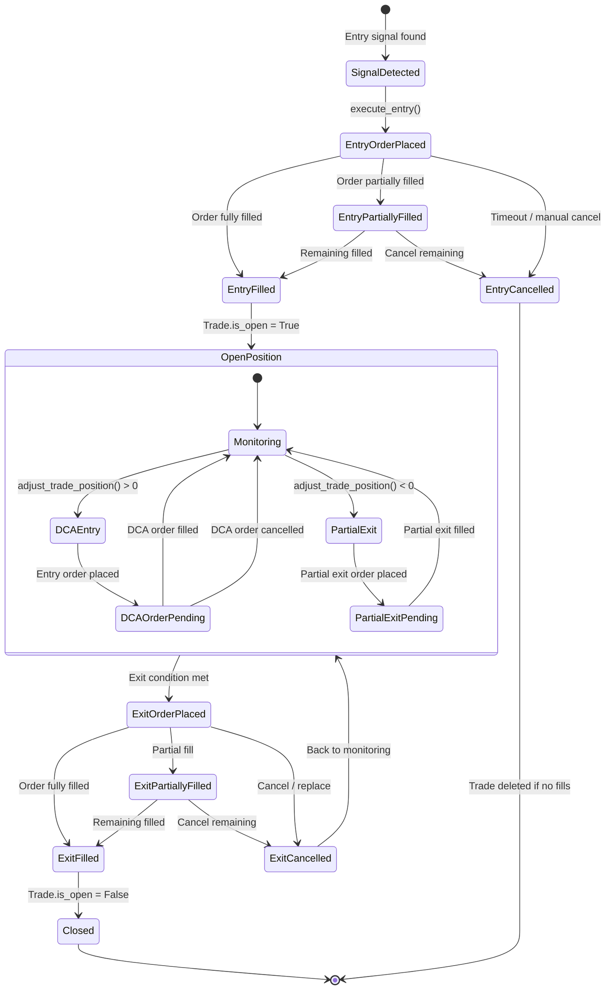
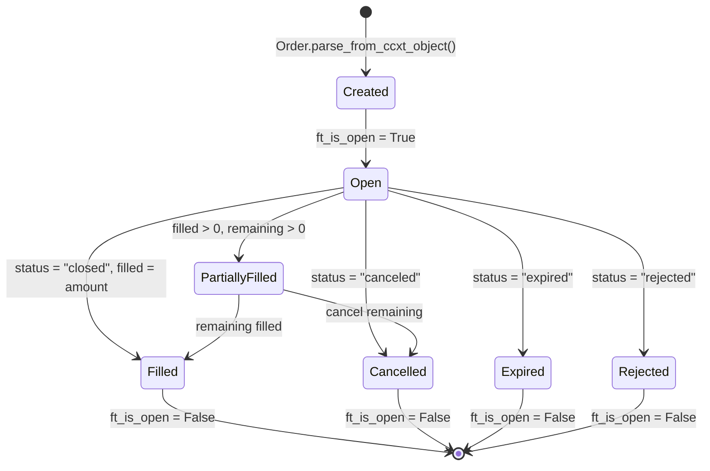
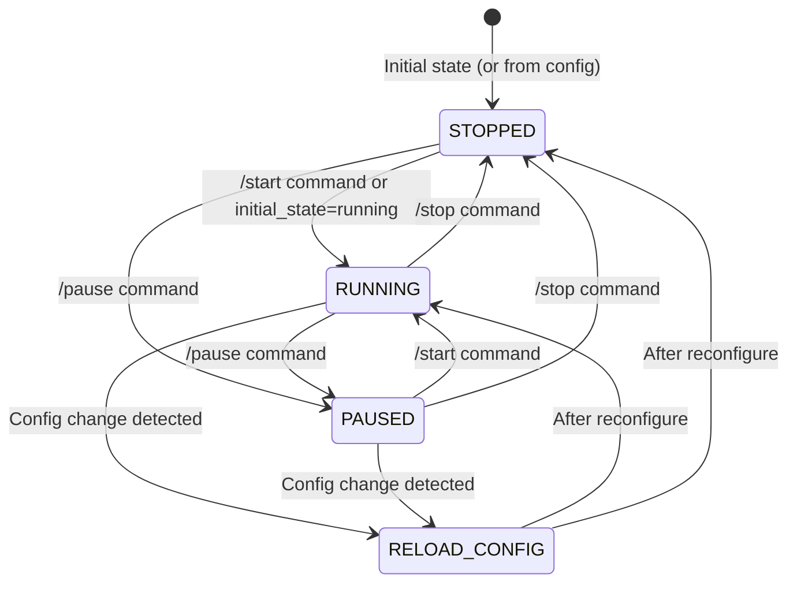
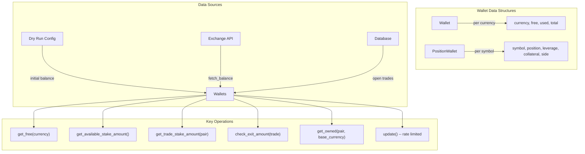
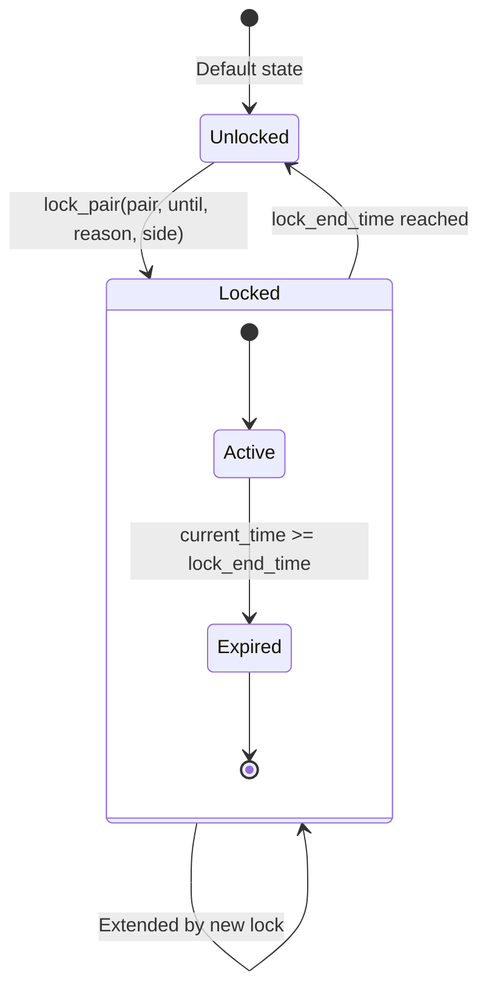
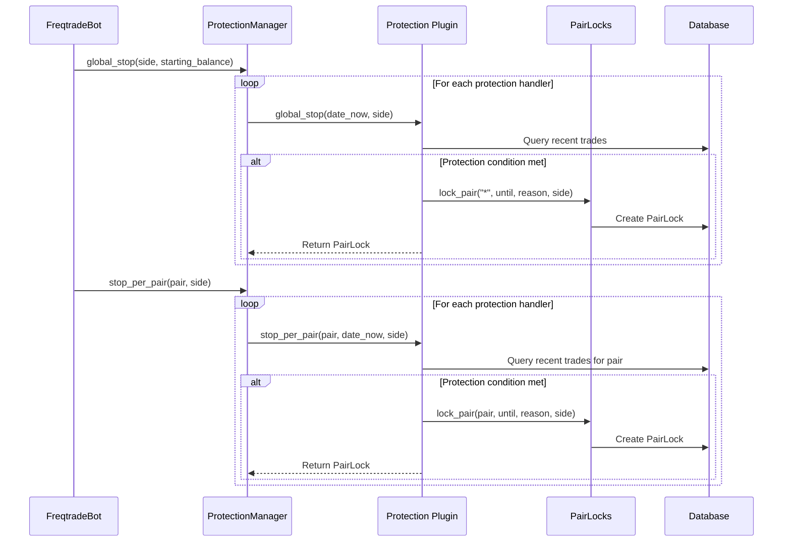

# Freqtrade State Management

## Trade State Machine

A trade in Freqtrade progresses through a series of states from initial entry signal detection to final closure. The `Trade` model (`src/freqtrade/persistence/trade_model.py`) tracks the complete lifecycle.



### Trade Fields by State

| State | `is_open` | `exit_reason` | `close_date` | `close_profit` |
|-------|-----------|---------------|--------------|----------------|
| Entry Order Placed | `True` | `""` | `None` | `None` |
| Open Position | `True` | `""` | `None` | `None` |
| Exit Order Placed | `True` | set to reason | `None` | `None` |
| Closed | `False` | final reason | set | calculated |

### Exit Reasons (`ExitType` enum)

Trades can be closed for the following reasons:

| Exit Type | Description |
|-----------|-------------|
| `ROI` | Minimal ROI table threshold reached |
| `STOP_LOSS` | Fixed stoploss hit |
| `TRAILING_STOP_LOSS` | Trailing stoploss triggered |
| `STOPLOSS_ON_EXCHANGE` | Exchange-managed stoploss filled |
| `EXIT_SIGNAL` | Strategy exit signal detected |
| `CUSTOM_EXIT` | Strategy `custom_exit()` returned a reason |
| `FORCE_EXIT` | Manual exit via Telegram/API |
| `EMERGENCY_EXIT` | Emergency sell (e.g., stoploss order failed) |
| `PARTIAL_EXIT` | DCA partial position reduction |
| `LIQUIDATION` | Position liquidated (futures) |
| `SOLD_ON_EXCHANGE` | Order found on exchange not tracked in DB |

## Order State Lifecycle

Each trade can have multiple orders (entry, exit, stoploss, DCA). The `Order` model mirrors the CCXT order structure.



### Order Types

| `ft_order_side` | Purpose |
|-----------------|---------|
| `"buy"` | Long entry or short exit |
| `"sell"` | Long exit or short entry |
| `"stoploss"` | Exchange-managed stoploss order |

### Order Status Mapping

Freqtrade maps CCXT order statuses:

| CCXT Status | `ft_is_open` | Action |
|-------------|-------------|--------|
| `"open"` | `True` | Continue monitoring |
| `"closed"` | `False` | Process fill, update trade |
| `"canceled"` | `False` | Handle cancellation |
| `"expired"` | `False` | Treat as cancellation |
| `"rejected"` | `False` | Log and clean up |

### Order Fields

Key fields tracked per order:

```
Order
  id                  -- Internal database ID
  ft_trade_id         -- Foreign key to Trade
  order_id            -- Exchange order ID
  ft_order_side       -- "buy" / "sell" / "stoploss"
  ft_pair             -- Trading pair
  ft_is_open          -- Whether order is still active
  ft_amount           -- Original requested amount
  ft_price            -- Original requested price
  ft_cancel_reason    -- Cancellation reason if cancelled
  ft_order_tag        -- Custom tag (e.g., DCA entry tag)
  status              -- Exchange status string
  order_type          -- "limit" / "market" / "stop" etc.
  side                -- "buy" / "sell"
  price               -- Limit price
  average             -- Average fill price
  amount              -- Total amount
  filled              -- Filled amount
  remaining           -- Remaining amount
  cost                -- Total cost (filled * average)
  stop_price          -- Stoploss trigger price
  order_date          -- When order was placed
  order_filled_date   -- When order was fully filled
  funding_fee         -- Accumulated funding fees (futures)
```

## Bot State Management

The bot operates in one of four states, managed by the `State` enum:



### State Behaviors

| State | Behavior |
|-------|----------|
| **RUNNING** | Full trading loop: fetch data, analyze, enter/exit trades, manage orders |
| **PAUSED** | Same as RUNNING but skips new entries and DCA position increases. Existing exits and stoploss management continue. |
| **STOPPED** | Minimal processing. Optionally cancels open orders (`cancel_open_orders_on_exit`). Warns about open trades. |
| **RELOAD_CONFIG** | Transient state. Worker cleans up the current `FreqtradeBot` instance and creates a new one with reloaded configuration. Returns to RUNNING or STOPPED. |

### Worker Loop

The `Worker._worker()` method handles state transitions:

```python
while True:
    state = self._worker(old_state=state)
    if state == State.RELOAD_CONFIG:
        self._reconfigure()  # Clean up, reload config, reinitialize bot
```

In RUNNING/PAUSED states, the worker throttles to the configured `process_throttle_secs` (default 5 seconds) and aligns to candle boundaries when possible (with a 1-second offset to ensure new candle data is available).

## Position Tracking

### Trade Position Model

Each `Trade` (or `LocalTrade` in backtesting) tracks the complete position state:

```
Trade
  pair                -- Trading pair (e.g., "BTC/USDT")
  stake_amount        -- Total stake invested
  amount              -- Current position size in base currency
  open_rate           -- Weighted average entry price
  leverage            -- Leverage multiplier
  is_short            -- Short position flag
  trading_mode        -- SPOT / MARGIN / FUTURES

  Stoploss tracking:
    stop_loss           -- Current absolute stoploss price
    stop_loss_pct       -- Current stoploss as percentage
    initial_stop_loss   -- Initial stoploss at trade open
    is_stop_loss_trailing -- Whether trailing SL is active
    max_rate            -- Highest price reached (for trailing SL)
    min_rate            -- Lowest price reached

  Profit tracking:
    close_rate          -- Exit price (when closed)
    close_profit        -- Profit ratio
    close_profit_abs    -- Absolute profit in stake currency
    realized_profit     -- Accumulated realized profit (from partial exits)

  Futures-specific:
    liquidation_price   -- Calculated liquidation price
    funding_fees        -- Accumulated funding fees
    interest_rate       -- Margin interest rate
```

### Position Recalculation

When DCA orders fill, `Trade.recalc_trade_from_orders()` recalculates:

1. **Total amount**: Sum of all filled entry orders minus filled exit orders
2. **Average entry price**: Weighted average of all entry order fill prices
3. **Stake amount**: Recalculated from filled orders
4. **Open trade value**: Updated based on new average price

This ensures accurate profit calculations even with multiple entries at different prices.

## Wallet/Balance Management

The `Wallets` class (`src/freqtrade/wallets.py`) manages balance tracking for all currencies.



### Balance Calculation

- **Dry-run mode**: Wallets are simulated from `dry_run_wallet` configuration and adjusted by open trade stakes
- **Live mode**: Balances fetched from exchange via `exchange.get_balances()`
- **Update frequency**: Rate-limited to avoid excessive API calls (configurable, default ~1 hour)

### Stake Amount Calculation

`get_trade_stake_amount(pair, max_open_trades)` calculates the available stake for a new trade:

1. Start with total available balance
2. Subtract amount reserved for open trades
3. Apply `tradable_balance_ratio` (default 0.99, reserves some for fees)
4. Divide by remaining free slots (`max_open_trades - current_open_trades`)
5. Apply `stake_amount` configuration (fixed amount or "unlimited")
6. Enforce exchange minimum/maximum limits

## Lock Management

The `PairLocks` middleware manages time-based trading restrictions.



### Lock Types

| Lock Scope | `pair` | `side` | Description |
|------------|--------|--------|-------------|
| Pair-specific | `"BTC/USDT"` | `"long"` | Lock specific pair + direction |
| Pair both sides | `"BTC/USDT"` | `"*"` | Lock pair for both long and short |
| Global | `"*"` | `"*"` | Lock all trading globally |

### Lock Sources

Locks are created by:

1. **Protection plugins** -- `CooldownPeriod`, `StoplossGuard`, `MaxDrawdownProtection`, `LowProfitPairs`
2. **Strategy code** -- `self.lock_pair(pair, until, reason)` in strategy methods
3. **Manual** -- Via Telegram `/locks` command or API

### Lock Storage

- **Live/dry-run**: Stored in database (`PairLock` model) with SQLAlchemy
- **Backtesting**: Stored in-memory (`PairLocks.locks` list) -- the `PairLocks.use_db` flag toggles between modes

### Lock End Time Alignment

Lock end times are rounded up to the next candle boundary using `timeframe_to_next_date()`, ensuring locks expire at clean candle transitions:

```python
lock_end_time = timeframe_to_next_date(PairLocks.timeframe, until)
```

### Protection-Lock Interaction



## Scheduled Tasks

`FreqtradeBot` maintains a `schedule.Scheduler` instance for periodic tasks:

| Task | Schedule | Condition |
|------|----------|-----------|
| `update_funding_fees()` | Every 30 min (HH:01, HH:31) | Futures mode only |
| `update_all_liquidation_prices()` | Every 30 min (HH:01, HH:31) | Futures + cross margin |
| `wallets.update()` | Every 30 min (HH:01, HH:31) | Futures mode only |
| `exchange.ws_connection_reset()` | Daily at 00:02 | Always |

The scheduler runs pending tasks at the end of each `process()` iteration via `self._schedule.run_pending()`.

---
## See Also
- [README](README.md) — Project overview and quick start
- [Architecture](architecture.md) — System design and components
- [Workflow](workflow.md) — Event flows and processing pipelines
- [Development](development.md) — Development guide and best practices
