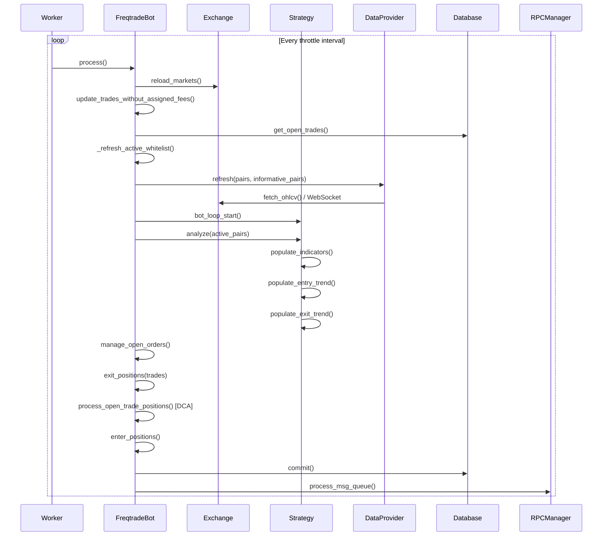
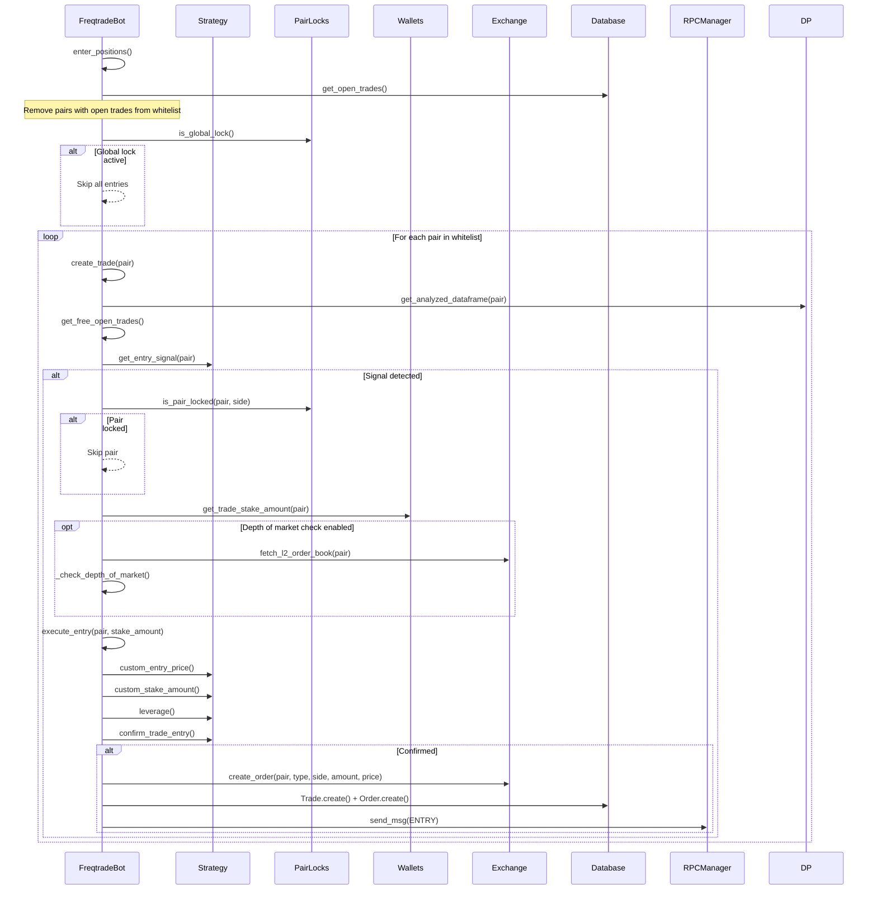
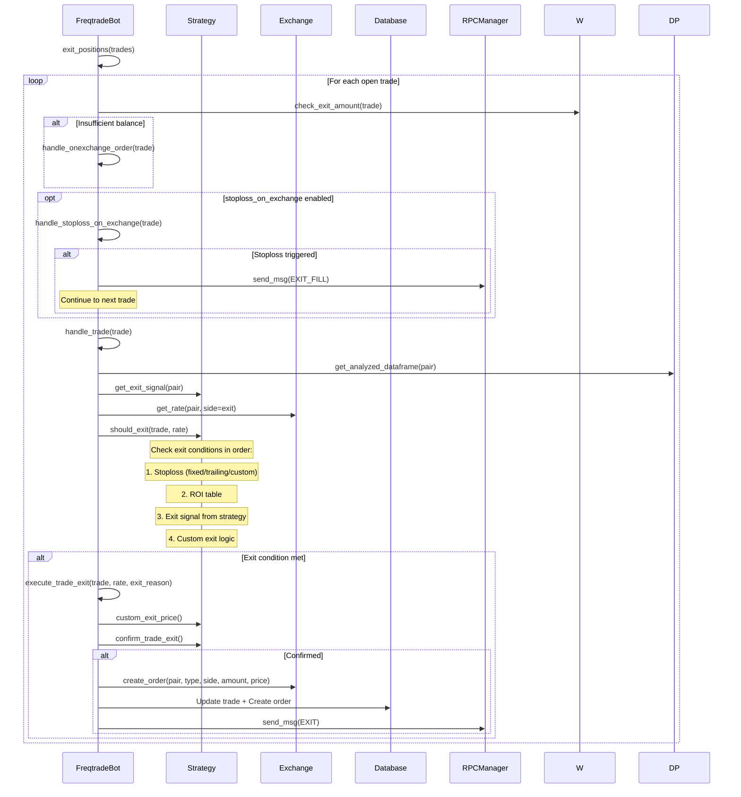
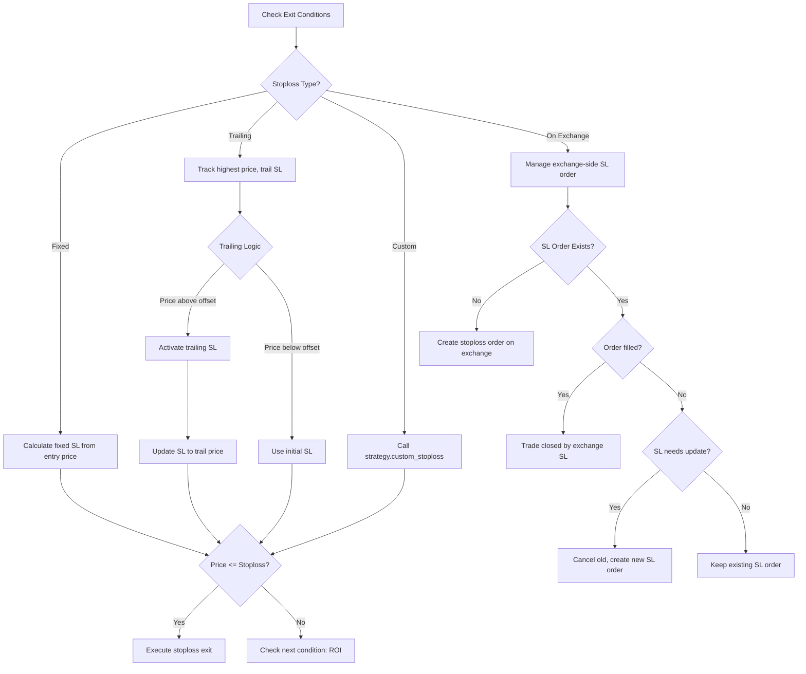
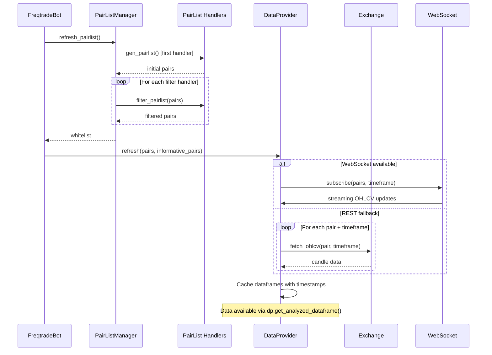
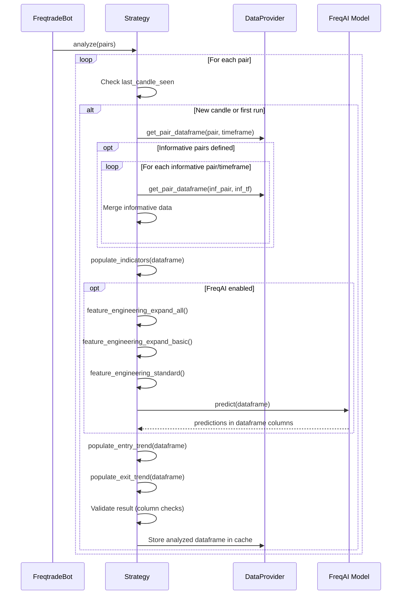
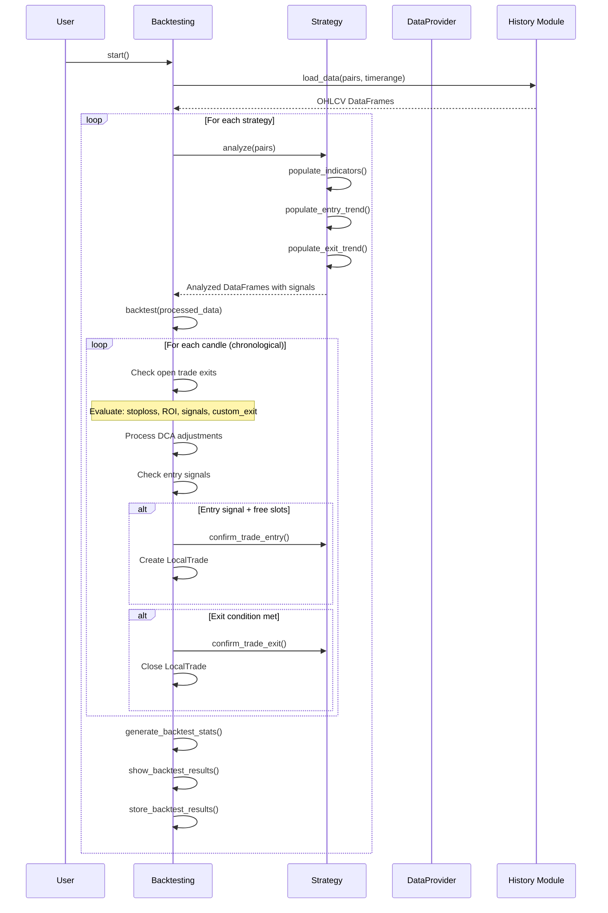
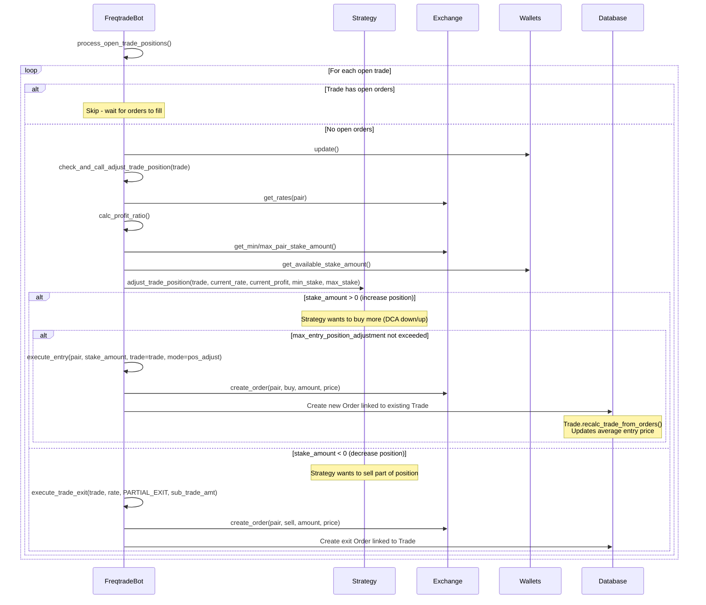

# Freqtrade Workflows

## Trading Lifecycle

The main trading loop runs inside the `Worker` class, which throttles execution to align with the configured timeframe. Each iteration calls `FreqtradeBot.process()`, which executes the full trading cycle.



## Key Workflows

### New Trade Entry Flow

When the strategy generates an entry signal for a pair, Freqtrade evaluates multiple conditions before placing an order.



### Trade Exit Flow

For each open trade, Freqtrade checks multiple exit conditions in priority order.



### Stoploss Handling

Freqtrade supports multiple stoploss mechanisms that are evaluated in each iteration.



### Market Data Update Cycle



### Strategy Signal Processing



### Backtesting Flow



### Hyperparameter Optimization Flow

```mermaid
sequenceDiagram
    participant User as User
    participant HO as Hyperopt
    participant Opt as HyperOptimizer
    participant BT as Backtesting
    participant S as Strategy
    participant Optuna as Optuna

    User->>HO: start()
    HO->>Opt: Initialize search spaces
    Opt->>S: Read parameter definitions
    Note over Opt: IntParameter, DecimalParameter,<br/>CategoricalParameter, BooleanParameter

    HO->>Opt: setup_study()
    Opt->>Optuna: Create study with search spaces

    loop For each epoch (parallel via joblib)
        Optuna->>Opt: suggest parameters (Trial)
        Opt->>S: Apply parameters to strategy
        Opt->>BT: backtest(processed_data)
        BT-->>Opt: Trade results

        Opt->>Opt: Calculate loss (selected loss function)
        Note over Opt: SharpeHyperOptLoss, SortinoHyperOptLoss,<br/>CalmarHyperOptLoss, MaxDrawDownHyperOptLoss, etc.

        Opt-->>Optuna: Report loss value
        Optuna->>Optuna: Update search model

        alt New best result
            HO->>HO: Update current_best_epoch
            HO->>HO: Display result
        end
    end

    HO->>HO: Store results to .fthypt file
    HO->>User: Display best parameters
```

### DCA (Dollar Cost Averaging) Flow

When `position_adjustment_enable = True` in the strategy, Freqtrade checks open trades each iteration for position adjustments.



## API/RPC Event Handling

The RPC system processes events asynchronously through a message queue. The `FreqtradeBot` enqueues messages during the trading loop, and they are dispatched to all registered handlers at the end of each iteration.

```mermaid
flowchart TB
    subgraph Events["Trade Events"]
        Entry[Entry Order Placed]
        EntryFill[Entry Order Filled]
        EntryCancel[Entry Cancelled]
        Exit[Exit Order Placed]
        ExitFill[Exit Order Filled]
        ExitCancel[Exit Cancelled]
        Protection[Protection Triggered]
        Status[Status Change]
    end

    subgraph Processing
        Entry --> Queue[Message Queue]
        EntryFill --> Queue
        EntryCancel --> Queue
        Exit --> Queue
        ExitFill --> Queue
        ExitCancel --> Queue
        Protection --> Queue
        Status --> Queue
    end

    Queue --> RPCManager

    subgraph Handlers["RPC Handlers"]
        RPCManager --> TG[Telegram]
        RPCManager --> API[REST API]
        RPCManager --> WS[WebSocket]
        RPCManager --> WH[Webhook]
        RPCManager --> DC[Discord]
    end

    subgraph TelegramCmds["Telegram Commands (Inbound)"]
        Start[/start] --> RPCCore[RPC Core]
        Stop[/stop] --> RPCCore
        StatusCmd[/status] --> RPCCore
        Profit[/profit] --> RPCCore
        ForceSell[/forcesell] --> RPCCore
        ForceBuy[/forcebuy] --> RPCCore
        RPCCore --> |state changes| Bot[FreqtradeBot]
    end

    subgraph APICmds["API Endpoints (Inbound)"]
        GET[GET /api/v1/status] --> RPCCore
        POST[POST /api/v1/forcebuy] --> RPCCore
        DELETE[DELETE /api/v1/trades/{id}] --> RPCCore
    end
```

### WebSocket Real-Time Updates

The API server supports WebSocket connections for real-time streaming of:

- Analyzed DataFrames (for live chart updates in FreqUI)
- Whitelist changes
- New candle notifications

Clients subscribe to specific message types via `RPCRequestType.SUBSCRIBE` and receive pushed updates as they occur.

---
## See Also
- [README](README.md) — Project overview and quick start
- [Architecture](architecture.md) — System design and components
- [State Management](state-management.md) — State lifecycle and data models
- [Development](development.md) — Development guide and best practices
